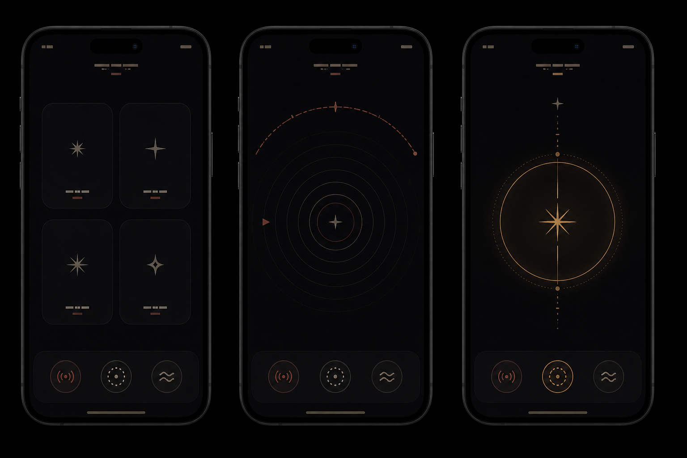

# 03 UI コンセプト比較

実装前に三案を比較し、A を主画面、C を画面ガイド、B を発見後の体験として組み合わせる。

| 案 | 中心表現 | 強み | 注意点 | 採用 |
|---|---|---|---|---|
| A. 聴覚レンズ | 中央照準、静かな同心波紋、方向を示す外周弧 | 暗順応を守り、音・触覚を主役にできる | 全天の位置関係は見えにくい | 主画面に採用 |
| B. 星座の糸 | 発見した星だけを細線でつなぐ | 詩的で、次の星を探す動機になる | 最初から出すと一般的な星図へ近づく | 発見後だけ採用 |
| C. 地平環 | 方位の円環と高度の縦軸 | 誤差方向が明確で実地検証にも強い | 計器感が強く、発見の情緒が弱い | 「見る」と診断表示に採用 |

## 推奨方針「暗闇の中の聴覚星図」

この画像は本プロジェクト用に生成したオリジナルの方向性資料であり、製品画面そのものではない。実装は SwiftUI の `Canvas` とシステムシンボルを中心にし、画像へ依存しない。

### 色

| 役割 | 値 |
|---|---|
| 背景 | `#020203` |
| パネル | `#09090D` |
| 主文字 | `#B9B2A7` |
| 副文字 | `#80796F`（パネル背景に対し 4.62:1） |
| 誘導 | `#AF6958`（パネル背景に対し 4.72:1） |
| 発見 | `#BC8658` |

色だけで状態を示さず、形、短い文言、音、触覚を必ず組み合わせる。純白、大面積の青、星雲写真、強いグローは使わない。

### 造形

- 通常線幅は 0.5–1.25 pt。
- 遠い時は外周弧が大きく曖昧で、近づくほど波紋が中央へ整う。
- 背後の星は小さな矢印にせず、「ゆっくり反対側へ」と広い弧で知らせる。
- 発見は 48 pt の輪が 92 pt へ最大 450 ms で一度だけ広がる。
- Reduce Motion では拡大をやめ、静止した二重輪と短いクロスフェードにする。
- Reduce Transparency では半透明パネルを不透明にする。

### 3 モード

- 聴く：左右は空間位置、上下は音色、近さは輪郭の明瞭さと間隔で示す。
- 触れる：音なし。近づくほどパルス間隔を短くし、星ごとの発見リズムを使う。
- 見る：外周弧、上下左右の語、中心輪を使う。音がなくても完了できる。

3 ボタンは同じ位置・大きさ・階層に置き、設定の奥へ隠さない。

## アクセシビリティ

- 装飾 Canvas は VoiceOver から隠す。
- 状態を「左へ 20 度、上へ 8 度、近づいています」の一要素にまとめる。
- 星カードは「シリウス。南東。高度 32 度。見ることができます」のように読む。
- 最小タップ領域 44 × 44 pt。
- 大きな文字では `ViewThatFits` と横ページングを使い、主要画面を縦スクロールへ変えない。
