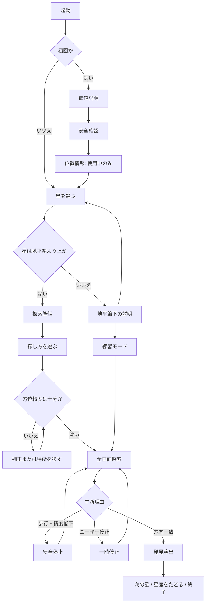

# 「星を聴く」UIコンセプト比較

更新日: 2026-09-06  
状態: 少数星MVPの実装前提案  
対象: iPhone / 日本語・英語 / 通信なし

## 1. この文書で決めること

「暗闇の中の聴覚星図」を、一般的な青い宇宙背景や情報量の多い星図に寄せず、次の体験として具体化する。

- 星を選ぶ
- その場に立ち止まり、端末を空へ向ける
- 音、触覚、画面のいずれかを主役にして方向を探す
- 星の方向と合ったことを、星固有の短い合図で知る
- 次の星、または星座の次の一点へ進む

本MVPでは、実写の星をカメラで認識したとは表現しない。現在地・日時・恒星座標と端末センサーから求めた方向への一致を「捉えた」とする。発見時の基本文言は「星の方向を捉えました / You found its direction」とし、観測事実を過剰に断定しない。

## 2. 共通するデザイン原則

### 2.1 視覚より先に、静かな手掛かりを置く

- 探索画面は星図、数値表、設定項目を常時並べず、中央の方向場を主役にする。
- 情報量は「対象星」「方向の手掛かり」「センサー状態」「停止／終了」の4種類に絞る。
- 色ではなく、位置、間隔、線の収束、短い言葉を組み合わせて状態を示す。
- 遠いほど曖昧、近いほど明瞭という同じ比喩を、音・触覚・画面に通す。
- 派手な星粒、流星、無限ループするパララックス、白いフラッシュは使わない。

### 2.2 3つの探し方を同格にする

初回と探索前に、次の3モードを同じ大きさ、同じ階層、同じ操作回数で提示する。おすすめバッジや視覚モードだけを強調する表現は置かない。前回の選択は保持するが、毎回ワンタップで変更できる。

| モード | 主な手掛かり | 画面を見続ける必要 | 単独で探索を完了できるか |
|---|---|---:|---:|
| 音で探す / Sound | 方向を持つ音、角度差に応じた明瞭さ、発見触覚 | なし | できる |
| 触覚で探す / Haptics | 近づくほど短くなるパルス間隔 | なし | できる |
| 画面で探す / Visual | 目標位置、細い軌跡、収束する波紋、発見触覚 | あり | できる |

モードが違っても、星の選択、開始、停止、センサー精度、地平線下、練習、完了、次の星という機能範囲は変えない。VoiceOver利用中の読み上げはアクセシビリティ支援であり、選択中のモードを勝手に「音で探す」へ変更しない。

方向が合った瞬間の星固有触覚は、触覚を利用できる限り3モードで共通にする。「音で探す」では星固有音も同時に鳴らし、「画面で探す」では固有の静かな輪の表情を併用する。触覚を無効にした利用者も、それぞれ音または画面だけで完了を理解できる。「触覚で探す」は明示どおり無音を守る。

### 2.3 安全を体験の外側へ追いやらない

- 探索開始前に「立ち止まる」「周囲と足元を確認する」を短い一画面で確認する。
- 探索中は上端に「立ち止まって使用 / Stand still」を常時表示する。
- 歩行らしい連続動作を検知した場合は探索フィードバックを一時停止し、歩きながらの継続を促さない。
- 車内、鉄骨、磁石、スピーカー付近で方位精度が落ちた場合は、発見判定を止める。精度不明のまま成功演出を出さない。
- 8の字補正は「周囲に十分な空間がある場合のみ」と明記し、できない場合は場所を移す選択肢を同格に出す。
- ヘッドフォン利用時は周囲音が聞こえる音量を案内し、車道、水辺、段差での使用を避けるよう開始前に伝える。

### 2.4 画面はページ送り、探索は全画面

主要な流れは状態ごとの全画面切り替えとし、縦長の説明ページにしない。通常の文字サイズでは、探索前後の主要操作に縦スクロールを使わない。

- 少数星MVPの星選択は2列グリッド、または横方向のページ送りで一画面に収める。
- 安全説明は要点を3項目までにし、詳細は別の「安全について」に置く。
- 詳細、権利表記、ヘルプはスクロール可能でよい。探索体験とは分離する。
- 非常に大きなDynamic Typeでは、文字の切り捨てよりページ分割または限定的なスクロールを優先する。「スクロールなし」をアクセシビリティより優先しない。

## 3. 共通の画面遷移



### 3.1 主要画面の役割

| 画面 | 主情報 | 主操作 | スクロール |
|---|---|---|---|
| 価値説明 | 「見えにくい星も、方向を音と触覚で探す」 | はじめる | なし |
| 安全確認 | 立ち止まる、周囲を見る、音量を抑える | 安全を確認した | なし |
| 星を選ぶ | 4星までの名前、見頃、現在の高度、地平線下 | 星を選択 | なし |
| 探索準備 | 方位精度、選択星、3モード | 探し始める | なし |
| 探索 | 方向場、センサー状態、停止 | 一時停止、モード変更 | なし |
| 発見 | 星名、星固有の合図、次の行動 | 次の星、星座をたどる、終わる | なし |
| 詳細・安全・出典 | 補足情報 | 戻る | 必要時のみ可 |

### 3.2 練習モードの扱い

- 昼、曇天、または星が地平線下のときでも、計算上の方向や用意した練習方向へ端末を向ける操作を試せる。
- 画面上端に常時「練習 / PRACTICE」を文字と枠形状で表示し、色だけに依存しない。
- 成功文言は「練習方向と合いました」であり、「星を発見しました」としない。
- 実際の星の現在方向を使う場合も、目視できたことや観測できたことを示唆しない。

## 4. コンセプトA — 同心の静寂 / Quiet Orbit

### 4.1 一文で表すと

見えない音源を囲む静かな波紋が、星の方向に近づくほど中央へ整い、最後に一つの小さな光点へ結ばれる。

### 4.2 探索画面の構成

```text
┌─────────────────────────┐
│ 立ち止まって使用        方位 良好 │
│                               │
│         北極星 / Polaris       │
│                               │
│        ・    ╭────╮            │
│      ╭───────┤  ◌  ├──╮         │
│      ╰───────┤  ·  ├──╯         │
│        細い軌跡 ╰────╯            │
│                               │
│        左へ 12° ・ 上へ 7°       │
│                               │
│ [一時停止]        [探し方を変更]  │
└─────────────────────────┘
```

- 中央の小点はiPhoneが現在向いている方向。
- 目標星は、相対方位・相対高度に応じて中央から外れた小点として置く。画面外の場合は外周の切れ目と「左／右・上／下」の短い言葉で示す。
- 1 px相当の細い波紋を最大3本だけ表示する。遠いときは間隔と位相がばらつき、近づくと同心になり、線が少し明瞭になる。
- センサー精度が低いときは目標点を大きなぼかしにせず、波紋の幅と「精度 低」の文字で不確かさを示す。発見判定は無効にする。
- 端末のロールは星の方向として扱わず、目標の左右・上下を不必要に回転させない。

### 4.3 各モードでの成立

- **音で探す:** 波紋は低コントラストの待機表示。星の相対方向に音源を置き、角度差が縮まるほど帯域の濁りが減って星固有の音色が現れる。音量だけを手掛かりにしない。画面を伏せ気味にしても完了でき、捕捉時は星固有音と星固有触覚の両方で知らせる。
- **触覚で探す:** 方向をゆっくり掃く「ホット／コールド」方式。角度差が縮まるほど単発パルスの間隔を短くする。iPhoneの単一の触覚位置で左右を装う複雑な符号はMVPでは採用しない。捕捉時のみ星固有の短いパターンに切り替える。
- **画面で探す:** 目標点、外周の方向印、細い軌跡、左右上下の短い言葉をすべて利用する。音や連続触覚がなくても完了でき、捕捉時は星固有触覚を既定で併用する。

VoiceOverが有効なら、「シリウス。右18度、上7度。方位精度は良好」のように、方向区分または距離帯が変わったときだけ読み上げる。センサー更新ごとの連続読み上げはしない。

### 4.4 発見演出

通常設定では650–900 msの一度きりの演出とする。

1. ばらついていた3本の波紋が中央で位相を合わせる。
2. 波紋が1本の細い輪になり、目標点へ静かに閉じる。
3. 星点が一度だけわずかに明るくなり、星名と「星の方向を捉えました」を表示する。
4. 星固有の短い触覚を1回だけ鳴らす。「音で探す」では星固有音も同時に1回だけ鳴らす。

紙吹雪、粒子の爆発、画面全面の白転、連続する鼓動、急な大音量は使わない。Reduce Motionでは線の移動・拡大縮小をやめ、輪の線種が整う静的な切り替えとテキスト表示だけにする。

### 4.5 強みと懸念

**強み**

- 波紋が音・触覚・画面に共通する「近づくほど整う」比喩になり、3モードの格差が小さい。
- 中央に情報を集められ、暗所で視線移動が少ない。
- 数値や星図を見せずに、方位差とセンサー信頼度を表現できる。
- 動きが少なく、Reduce Motion時にも意味を保ちやすい。

**懸念**

- 初見では波紋の乱れの意味が抽象的に感じられる可能性がある。
- 画面ガイド利用者には、左右・上下の補助文言と外周マーカーが不可欠。
- 星座の形そのものを見せる用途には向かない。

## 5. コンセプトB — 星へ結ぶ糸 / Resonant Thread

### 5.1 一文で表すと

iPhoneの現在方向から星へ伸びる一本の細い糸が、方向のずれに応じて曲がり、正しく向くとまっすぐにつながる。

### 5.2 探索画面の構成

```text
┌─────────────────────────┐
│ 立ち止まって使用        方位 良好 │
│            ・ Sirius          │
│           ╱                   │
│          ╱  音の波紋            │
│        ～～                    │
│       ╱                        │
│      ╱                         │
│     ◉ 現在向いている方向          │
│                               │
│       右へ向ける ・ 少し上へ       │
│ [一時停止]        [探し方を変更]  │
└─────────────────────────┘
```

- 下寄りの現在方向から、画面内または画面外の星へ細い曲線を引く。
- 方位のずれは曲線の左右の曲がり、高度のずれは終点の上下位置で示す。
- 星へ近づくと曲線が短く、細く、直線に近づく。音の波紋は糸の上を星側から1回ずつ伝わる。
- 発見後は糸をそのまま次の星へ伸ばし、星座を一点ずつたどる体験へ接続する。

### 5.3 各モードでの成立

- **音で探す:** 糸は音源の方向を可視化する副表示。画面を見なくても、音像と明瞭さだけで完了できる。
- **触覚で探す:** 触覚間隔はコンセプトAと同じ。ただし糸の曲がりを触覚だけで表現できないため、画面利用者と体験比喩が分かれる。
- **画面で探す:** 曲線が動作方向を直観的に示す。初回でも学習しやすく、星座への連続性が高い。

### 5.4 発見演出

曲がっていた糸が星点へまっすぐ接続し、張った弦のように一度だけ小さく震える。次に、星点から短い波紋が一つ戻る。Reduce Motionでは糸を即時に直線へ切り替え、線の太さと終端記号を変える。

### 5.5 強みと懸念

**強み**

- 「どちらへ動かすか」が画面上で最も理解しやすい。
- 一本の線だけで構成でき、一般的な星図より情報量を抑えられる。
- 発見後、次の星への線を出すことで星座をたどる流れに自然につながる。

**懸念**

- 画面ガイドが最も完成度の高い体験に見え、音・触覚モードが副次的に感じられやすい。
- 動く線を追わせるため、空や周囲より画面を凝視させるリスクがある。
- センサー誤差による線の揺れが目立ち、暗所で落ち着かない表示になりやすい。
- Reduce Motionではコンセプト固有の魅力が弱まりやすい。

## 6. 比較

評価語は「強い」「成立」「要対策」の3段階とし、数値による見せかけの精密さは付けない。

| 比較軸 | A: 同心の静寂 | B: 星へ結ぶ糸 |
|---|---|---|
| 聴覚中心の独自性 | **強い** — 音の波紋を全体の比喩にできる | 成立 — 糸は視覚比喩が中心 |
| 触覚のみの同格性 | **強い** — 間隔と収束の考え方が近い | 要対策 — 糸の曲がりを触覚へ移せない |
| 画面ガイドの初見理解 | 成立 — 言葉と外周印が必要 | **強い** — 進む方向が直観的 |
| 暗順応への配慮 | **強い** — 小面積、低コントラストで成立 | 成立 — 長い線の発光面積に注意 |
| 画面凝視を減らす | **強い** — 中央確認だけで離せる | 要対策 — 線を追いやすい |
| センサー誤差の表現 | **強い** — 波紋幅で不確かさを表せる | 要対策 — 線の揺れが指示に見える |
| Reduce Motion | **強い** — 静的な線種・間隔へ置換可能 | 成立 — 直線化の魅力は弱くなる |
| VoiceOverとの整合 | **強い** — 装飾を非表示にし、状態を一要素へ集約 | 成立 — 曲線自体は読み上げられない |
| 星座をたどる拡張 | 成立 — 発見後に別表現が必要 | **強い** — 次の星へ糸を延ばせる |
| 実装・検証の単純さ | **強い** — 少数の状態と図形で試せる | 成立 — 曲線安定化と揺れ対策が必要 |

## 7. 採用提案

少数星MVPでは、**コンセプトA「同心の静寂」**を採用する。

理由は次のとおり。

1. このアプリ固有の価値は星図を見ることではなく、画面から注意を離して音と触覚で方向を感じられることにある。Aはその価値を視覚モードにも翻訳できる。
2. 音・触覚・画面を「近づくほど間隔が整い、明瞭になる」という同じ文法に置ける。特に触覚のみが簡易版になりにくい。
3. センサーの揺れを指示線の揺れとして見せず、不確かさの幅として表現しやすい。誤った確信を与えにくい。
4. 中央の小さな領域だけを見ればよく、暗順応、片手操作、周囲確認、Reduce Motionと相性がよい。
5. 北極星・シリウスなど少数星で、方向差とフィードバックの分かりやすさを短期間に比較検証できる。

ただしBの長所は捨てない。**発見後に星座をたどる場面だけ**、直前の星と次の星を結ぶ一本の「糸」を静的に表示する。探索中の中心表現は波紋のままとし、画面ガイドだけが主役になることを避ける。

## 8. 採用案のビジュアル仕様

### 8.1 色

青い宇宙背景、鮮やかなネオン、純白を避ける。下記は初期候補であり、実機の最低輝度・True Tone・Night Shift・屋外暗所で確認して調整する。

| 用途 | 候補色 | 使い方 |
|---|---|---|
| 背景 | `#020304` 墨に近い黒 | OLEDでも輪郭が潰れすぎない最小限の差を残す |
| 主文字 | `#D0C8BC` 灰みの生成り | 星名、主要操作。大面積には使わない |
| 副文字 | `#837D75` 暖灰 | 角度、補助説明 |
| 星・捕捉 | `#B86F52` 低彩度の赤銅 | 星点、選択、発見時の一度だけの強調 |
| 正常 | `#6F8074` 灰緑 | 方位精度が十分な状態。必ず文字を併記 |
| 注意 | `#B28B57` 鈍い琥珀 | 補正、地平線下、安全停止。必ず記号と文字を併記 |

- 通常文字は背景とのコントラスト4.5:1以上を保つ。夜間らしさのために可読性を犠牲にしない。
- 捕捉、精度、注意は色だけで区別しない。点／輪／破線、アイコン、短いラベルを併用する。
- アプリがシステム輝度を勝手に変更しない。初回だけ、ユーザー自身で無理のない明るさへ調整する案内を出す。
- 「コントラストを上げる」が有効な場合は、副文字と細線の輝度差を上げる。大きな発光面積は増やさない。

### 8.2 文字

- 本文・操作: iOSシステムフォント、RegularまたはMedium。
- 星名: システムフォントのセリフデザインを候補とし、日本語で字形が不安定な場合は本文と同じサンセリフへ戻す。外部フォントは持ち込まない。
- 基準サイズ: 星名 28 pt、画面見出し 22 pt、本文・操作 17 pt、補助情報 13 pt以上。
- Dynamic Typeを全画面で有効にする。星名と重要な安全文は1行固定や縮小で押し込まない。
- 英語は全大文字を常用しない。「PRACTICE」など誤認防止に必要な短い状態表示だけに限定する。
- 日本語と英語を同時表示せず、端末言語に合わせる。固有名は、初回の選択画面でのみローカライズ名とIAU等の正式な表記方針に基づく名称を補助表示できる。

### 8.3 波紋と細い軌跡

- 波紋は最大3本、線幅は通常1 pt相当、最大不透明度35%を初期値とする。
- 遠方では波紋同士の中心を少しずらし、接近すると中心と間隔を揃える。常時回転させない。
- 更新はセンサー値をそのまま描かず、視覚用に平滑化する。ただし表示遅延で誤誘導しない範囲を技術検証する。
- 細い軌跡は直近の方向変化を短く残し、「どちらから近づいたか」を示す。長い航跡や装飾的な星屑にはしない。
- 目標が画面外のときは、外周の一部を切った記号と「左／右・上／下」を出す。矢印だけにしない。
- センサー信頼度が低い場合は波紋を破線にし、「方位を確認できません」と表示する。演出として曖昧にせず、探索を明示的に停止する。

### 8.4 発見状態

- 発見判定はUI単独で決めず、角度差、継続時間、方位精度が条件を満たしたイベントだけを受け取る。
- 発見演出は一度だけ。方向から外れた直後に成功と未成功を高速反復しないよう、再発火にヒステリシスを設ける。
- 星固有の音・触覚は短く、オリジナル制作とする。大音量、驚かせる強い衝撃、既存作品を想起させる旋律は避ける。
- 発見後も「実写認識」や「見えた」という語を使わず、「方向を捉えた」と表示する。

## 9. モダリティ別の状態マッピング

角度帯は技術検証を始めるための仮値であり、屋外実機テストで調整する。

| 状態 | 音で探す | 触覚で探す | 画面で探す |
|---|---|---|---|
| 遠い（仮: 30°超） | 広く拡散し、星固有成分は弱い | 約1.4–1.8秒間隔 | 目標は外周、波紋中心は大きくずれる |
| 近づく（仮: 10–30°） | 音像が寄り、濁りが減る | 約0.7–1.2秒間隔 | 目標点が画面内へ入り、短い軌跡が現れる |
| 近い（仮: 3–10°） | 星固有の倍音が明瞭になる | 約0.25–0.6秒間隔 | 波紋が中央へ揃い、線が明瞭になる |
| 捕捉候補（仮: 3°以内） | 急な音量増加なし。音色を安定 | 短い一定間隔。強度は上げすぎない | 一本の輪へ収束する準備状態 |
| 捕捉確定 | 星固有の短い音と触覚を1回 | 星固有の短い触覚を1回。無音を維持 | 輪が閉じ、星名と完了文言。星固有触覚を1回 |
| 方位精度不足 | 方向音を止め、短い状態音を1回 | 離れた長めの2パルス後に停止 | 破線と停止オーバーレイ、補正案内 |
| 歩行らしい動作 | 音を穏やかにフェード停止 | 1回の停止パターン後に停止 | 「立ち止まって再開」を全面表示 |

触覚のみでは、左右を複雑な符号へ置換しない。ユーザーがその場でゆっくり向きを変え、間隔が短くなる方向を探す。屋外テストで探索時間が長すぎる場合は、複雑な触覚符号ではなく、任意で一度だけ方向を読み上げる「方向を聞く」操作を検討する。

## 10. アクセシビリティ

### 10.1 VoiceOver

- 装飾の波紋、軌跡、背景はアクセシビリティツリーから除外する。
- 探索中央部を一つの更新要素として扱い、「対象、左右方向、上下方向、角度帯、精度」をまとめる。
- 読み上げは最短2秒間隔を目安にし、方位区分や距離帯が変わった場合だけ行う。小さなセンサー揺れを逐次読まない。
- 主要順序は「安全状態 → 星名 → 探索状態 → 一時停止 → 探し方を変更」。視覚上の座標順だけに任せない。
- カスタムアクションとして「方向をもう一度聞く」「一時停止／再開」「探し方を変更」「星選択へ戻る」を用意する。
- VoiceOverが話している間は方向音を少し下げ、終わったら滑らかに戻す。星固有音と読み上げを重ねない。
- 発見時は「シリウスの方向を捉えました」と一度だけ通知する。

### 10.2 Reduce Motionなど

- Reduce Motion: 波紋の移動、糸の振動、星点の拡大縮小を止める。線種、位置、文字、色の一度きりの切り替えで同じ情報を伝える。
- Reduce Transparency: 半透明のオーバーレイを不透明な墨色面へ切り替える。
- Differentiate Without Color: 正常は実線、注意は破線、停止は二重線と文字にし、色がなくても状態を判別できるようにする。
- Dynamic Type: 通常サイズでは固定レイアウト、大サイズでは中央図形を縮め、最上位サイズでは「状態」と「操作」を2ページに分ける。文字の切り捨てはしない。
- 音声や触覚をOS設定で利用できない場合は、モード選択時に理由と代替モードを簡潔に示す。勝手に切り替えない。

## 11. 片手操作

- 主要ボタンの実効タップ領域は最低44 × 44 pt、推奨高さ52 pt。
- 「一時停止」「探し方を変更」は画面下部35%以内へ置く。星名、精度、安全状態は上部に置き、誤タップ対象にしない。
- 探索開始は明示ボタンとし、端末を持ち上げただけで突然音や触覚を開始しない。
- スワイプ、長押し、端末シェイクを必須操作にしない。すべてのジェスチャーに表示ボタンを用意する。
- モード変更は一度タップすると3つの同サイズ選択肢が下から現れ、二度目のタップで確定する。探索はその間一時停止する。
- 左右どちらの手でも使える中央寄せ配置にし、画面端の小さなアイコンだけへ重要操作を置かない。
- 誤操作防止のため、終了と星変更は一時停止画面にまとめる。探索中の中央タップに破壊的な意味を持たせない。

## 12. センサー・環境状態の見せ方

| 状態 | 短い表示 | 画面の挙動 | 次の行動 |
|---|---|---|---|
| 方位良好 | 方位 良好 | 通常探索 | 続ける |
| 方位精度低 | 方位を確認中 | 発見判定停止、波紋を破線化 | 数秒待つ |
| 磁気干渉疑い | 磁気の影響があります | 全モードを一時停止 | 車・鉄骨・磁石から離れる |
| 補正が必要 | 方位を補正 | 探索を一時停止 | 周囲を確認後8の字、または場所を移す |
| 位置情報なし | 現在地が必要です | 星の現在方向を計算しない | 使用中のみ許可、または説明へ |
| 地平線下 | 今は地平線の下です | 通常探索を開始しない | 別の星、時刻案内、練習 |
| 歩行らしい動作 | 立ち止まって再開 | 音・触覚・発見判定停止 | 安全な場所で停止し再開 |
| カメラ暗所限界 | カメラでは見えにくい環境です | 計算・センサー探索は継続 | カメラ補助を閉じる |

精度を星5段階やパーセントで装飾的に見せない。Core Location等から得られる精度情報を「良好／確認中／利用不可」の行動可能な3状態へまとめ、数値詳細は診断画面だけに置く。

## 13. カメラ補助モード

- カメラは「画面で探す」の追加操作であり、星探索の前提ではない。
- 初回起動ではカメラ権限を求めず、ユーザーが「カメラ補助」を明示的に選んだときだけ求める。
- 表示する星点・星座線は天体計算と姿勢から投影した補助線であり、画像認識結果ではないことを明記する。
- 暗所では映像が粗く、露光遅延やセンサー誤差で重ならない可能性を短く説明する。
- 方位精度が低いときは星座線を実線表示せず、停止状態にする。誤った位置へ確信のある線を置かない。
- カメラ映像上でも青い宇宙加工、星の増幅、既存星図風の装飾を加えない。低彩度の赤銅色の点と細線だけを使う。
- 閉じる操作を親指の届く下部に置き、探索の音／触覚モードへすぐ戻れるようにする。

## 14. 主要コピー案（日英）

同一画面で二言語を併記するのではなく、ローカライズ時の意味を揃えるための基準とする。

| 場面 | 日本語 | English |
|---|---|---|
| 安全 | 立ち止まって使ってください | Use while standing still |
| 探索開始 | 星の方向を探す | Find its direction |
| 一時停止 | 探索を一時停止 | Pause search |
| 捕捉 | 星の方向を捉えました | You found its direction |
| 精度不足 | 方位を確認できません | Heading is unavailable |
| 磁気干渉 | 車、鉄骨、磁石から離れてください | Move away from vehicles, steel, and magnets |
| 補正 | 周囲を確認してから、iPhoneを8の字に動かしてください | Check your surroundings, then move iPhone in a figure eight |
| 地平線下 | この星は今、地平線の下です | This star is currently below the horizon |
| 練習 | 練習方向と合いました | You matched the practice direction |
| カメラ補助 | 線は計算上の目安です | Lines show calculated guidance |

## 15. 実装前プロトタイプの確認項目

2案を同じセンサーデータの再生で比較し、少なくとも通常文字サイズと大きな文字サイズ、VoiceOver、Reduce Motionで確認する。

### 15.1 必須シナリオ

1. 北極星を選び、「音で探す」で探索を開始・一時停止・再開できる。
2. シリウスを選び、「触覚で探す」だけで近づいた／離れたを理解できる。
3. 「画面で探す」で左右と上下の修正方向を5秒以内に説明できる。
4. 方位精度低下中に発見演出が出ず、次の行動が分かる。
5. 地平線下の星から、別の星または練習へ迷わず移れる。
6. 歩行らしい動作で停止し、安全な場所で再開できる。
7. 発見後、次の星または終了を片手で選べる。
8. VoiceOverだけで星名、方向、精度、停止、完了を把握できる。
9. Reduce Motionで動きを止めても、接近・捕捉・停止の違いが分かる。
10. 日本語と英語で重要文言が切れず、ボタンの意味が変わらない。

### 15.2 レイアウト受入条件

- 375 × 667 pt相当から430 × 932 pt相当まで、通常Dynamic Typeで主要画面に縦スクロールがない。
- 主要操作はSafe Area内にあり、44 × 44 pt以上のタップ領域が重ならない。
- 星名、方向、安全状態、精度状態がノッチ／Dynamic Island／ホームインジケータに隠れない。
- 非常に大きなDynamic Typeではページ分割または限定スクロールへ安全に切り替わり、文字を省略しない。
- VoiceOverのフォーカスがセンサー更新で勝手に先頭へ戻らない。
- Reduce Motion時に自動移動、反復パルス状アニメーション、震える線が残らない。
- 色をグレースケール表示しても、正常・注意・停止・捕捉を文字と形で区別できる。

### 15.3 採用判断

A案が次のいずれかを満たせない場合だけ、B案または混成案を再検討する。

- 初回利用者が外周印と短い言葉から修正方向を理解できる。
- 触覚のみで、画面を見ずに接近と離反を区別できる。
- センサー揺れが不快な視覚ノイズにならない。
- 音・触覚・画面のどのモードからも、同じ安全停止と完了へ到達できる。

## 16. 今回は採用しない表現

- 青い星雲、紫のグラデーション、無数の装飾星、レンズフレア
- コンパス目盛り、座標、赤経赤緯、方位角・高度の常時表示
- ARカメラを起動時の既定画面にすること
- 画面全面を使った白い成功フラッシュ、紙吹雪、長いファンファーレ
- 触覚の強さだけを上げ続けること、驚かせる強い衝撃
- 精度が低い状態で目標線を確定表示すること
- 歩きながら星を追うように見える歩数、距離、ルート表示
- 縦にカードを積み上げるダッシュボード型ホーム
- 重要操作をスワイプ、シェイク、長押しだけに割り当てること

## 17. MVPでの結論

MVPの主探索画面は「同心の静寂」で進める。波紋と小点を中心に、画面を見ない音・触覚モードにも同じ「遠いと曖昧、近いと明瞭」という文法を通す。発見後に星座をたどる場面だけ「星へ結ぶ糸」を使う。

次のデザイン工程では、北極星とシリウスを対象に、次の4状態だけを先にプロトタイプ化する。

1. 遠い
2. 近づいている
3. 方位精度不足で停止
4. 方向を捕捉

ここで屋外実機により、画面を見ない探索の成立、暗所の可読性、センサー揺れ、安全停止を確認してから、星座をたどる遷移とカメラ補助を追加する。
